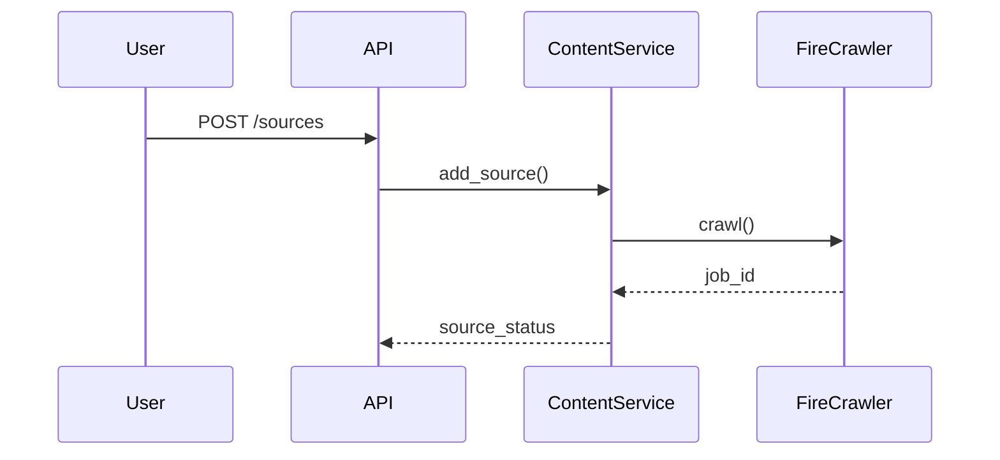
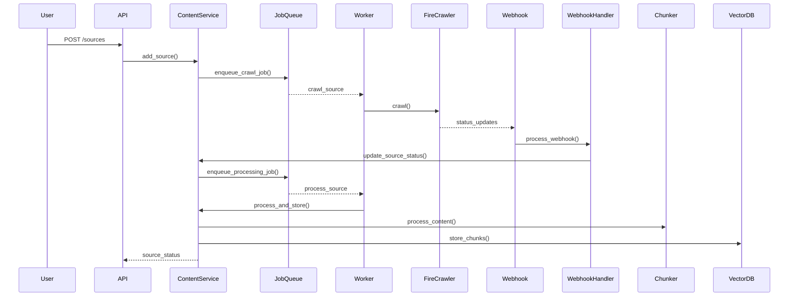

# Content Source Management Feature Specification

## 1. Core Flow

### Simplified User Flow (Expanded and Corrected)

1.  **User Interaction:** User initiates the process via a UI or command, triggering a POST request to the `/sources` endpoint with the `AddContentSourceRequest` data.

2.  **API Endpoint (`/sources`):**
    *   Validates the request using the `AddContentSourceRequest` Pydantic model.
    *   Calls `ContentService.add_source()`.

3.  **`ContentService.add_source()`:**
    *   Creates a new `Source` object with status `PENDING`.
    *   Creates a `CrawlRequest` object from the input.
    *   Persists the `Source` to the `SourceRepository` (Supabase).
    *   Stores the `CrawlRequest` data as a dictionary in `Source.data`.
    *   Enqueues a "crawl" job in the `JobQueue` (Redis), passing the `source_id`.
    *   Returns a `ContentAPIResponse` to the user immediately, containing the `source_id` for tracking progress.

4.  **Job Queue and Worker (Crawling):**
    *   A worker process continuously monitors the `JobQueue`.
    *   When the "crawl" job is dequeued, the worker calls `ContentService.crawl_source(source_id)`.

5.  **`ContentService.crawl_source(source_id)`:**
    *   Retrieves the `Source` from the `SourceRepository` using the `source_id`.
    *   Updates the `Source` status to `CRAWLING`.
    *   Calls `FireCrawler.crawl(source_details)`, which interacts with the FireCrawl API and sets up webhooks.  This call returns immediately.

6.  **Webhook Endpoint (`/webhook/firecrawl`):**
    *   Receives webhook updates from FireCrawl.
    *   Validates the webhook payload using the `WebhookPayload` model.
    *   Extracts `source_id`, `status`, and other relevant data.
    *   Calls `ContentService.update_source_status(source_id, status, data)`.

7.  **`ContentService.update_source_status()`:**
    *   Retrieves the `Source` from the `SourceRepository`.
    *   Updates the `Source` status and other relevant data.
    *   If the status is `COMPLETED`, enqueues a "process" job in the `JobQueue`.
    *   If the status is `FAILED`, logs the error and updates the `Source`.

8.  **Job Queue and Worker (Processing):**
    *   A worker process picks up the "process" job and calls `ContentService.process_source(source_id)`.

9.  **`ContentService.process_source(source_id)`:**
    *   Retrieves the `Source` and crawled data.
    *   Updates the `Source` status to `PROCESSING`.
    *   Performs chunking, embedding, and storing (using `Chunker`, `Embedder`, `VectorDB`).
    *   Updates the `Source` status to `COMPLETED`.

10. **User Notification (Optional):** The user can poll `/sources/{source_id}` or use Server-Sent Events (SSE) for updates.


### Current Implementation


### Proposed Implementation (Asynchronous with Webhooks)


Key Differences:
1. Asynchronous processing using a job queue (Redis).
2. Webhook handling for crawl status updates.
3. Content processing flow (chunking, embedding, storing).
4. Explicit error handling and retry mechanisms.

## 2. States & Status

### Source States
```
enum SourceState {
  PENDING = 'pending',     // Initial state
  CRAWLING = 'crawling',   // FireCrawl active
  PROCESSING = 'processing', // Chunking/embedding
  COMPLETED = 'completed', // Ready for use
  FAILED = 'failed'       // Terminal error
}
```

### State Transitions
```
PENDING -> CRAWLING -> PROCESSING -> COMPLETED
    |          |           |            
    +--------> +--------> + ---------> FAILED
```

## 3. API Contract

### API Models
```python
# Models should all be Python/Pydantic
from enum import Enum
from datetime import datetime
from typing import Any, Dict, List, Optional

from pydantic import BaseModel, Field, HttpUrl


class SourceState(str, Enum):  # Unified SourceState enum
    """Source processing states."""
    PENDING = "pending"
    CRAWLING = "crawling"
    PROCESSING = "processing"
    COMPLETED = "completed"
    FAILED = "failed"


class ContentSourceConfig(BaseModel):
    """Source configuration."""
    max_pages: int = Field(default=50, gt=0)
    exclude_sections: List[str] = Field(default_factory=list)


class AddContentSourceRequest(BaseModel):
    """Request to add new content source."""
    type: str  # Literal["web"] - Simplified for now
    name: str
    url: HttpUrl
    config: ContentSourceConfig


class SourceAPIResponse(Source):
    """Simplified model inheriting from Source."""

    status: SourceState = Field(..., description="Current processing status of the content source.")
    created_at: datetime = Field(..., description="Timestamp of content source creation.")
    updated_at: datetime = Field(..., description="Timestamp of the last update to the content source.")
    total_pages: int = Field(default=0, description="Total number of pages crawled (updated after completion).")
    config: ContentSourceConfig = Field(..., description="Configuration parameters of the content source.")
    job_id: Optional[str] = Field(None, description="Unique identifier of the associated crawling job.")


class SourceStatusResponse(BaseModel): # Renamed for clarity
    """Source processing status response."""
    status: SourceState
    error: Optional[str] = None
    progress: Optional[Dict[str, Any]] = None


class WebhookPayload(BaseModel): # New model for webhook payloads
    """Expected format of webhook payloads."""
    source_id: str
    event: str
    timestamp: datetime
    data: Dict[str, Any]
```

## 4. Implementation Requirements

### 4.1. Data Models

```python
from __future__ import annotations

import uuid
from datetime import datetime
from enum import Enum
from typing import Any, Dict, List, Optional, Protocol

from pydantic import BaseModel, Field, HttpUrl

# ... (API Models from section 3)

class CrawlJobStatus(str, Enum):
    PENDING = "pending"
    IN_PROGRESS = "in_progress"
    COMPLETED = "completed"
    FAILED = "failed"

class CrawlJob(BaseModel):
    id: uuid.UUID = Field(default_factory=uuid.uuid4)
    source_id: uuid.UUID
    status: CrawlJobStatus = CrawlJobStatus.PENDING
    created_at: datetime = Field(default_factory=datetime.utcnow)
    started_at: Optional[datetime] = None
    completed_at: Optional[datetime] = None
    result: Optional[Any] = None  # Can be a path, URL, or the data itself
    error: Optional[str] = None

class Document(BaseModel):
    id: uuid.UUID = Field(default_factory=uuid.uuid4)
    source_id: uuid.UUID
    url: str
    title: str
    content: str
    metadata: Optional[Dict[str, Any]] = None

class Chunk(BaseModel):
    id: uuid.UUID = Field(default_factory=uuid.uuid4)
    document_id: uuid.UUID
    content: str
    embedding: List[float]  # Store the embedding vector
    metadata: Optional[Dict[str, Any]] = None  # Store additional metadata

# Define interfaces/protocols for chunking and embedding strategies (optional)
class ChunkingStrategy(Protocol):
    def chunk(self, text: str) -> List[Chunk]: ...

class EmbeddingStrategy(Protocol):
    def embed(self, text: str) -> List[float]: ...
```

### 4.2. Classes and Interconnections

```python
from typing import List

# ... (Data Models and API Models)

class FireCrawler:
    async def crawl(self, source: Source, config: ContentSourceConfig) -> CrawlJob:
        # 1. Call FireCrawl API to initiate crawl, passing config.
        # 2. Store job ID in CrawlJob.
        # 3. Return CrawlJob.

    async def get_results(self, job_id: str) -> List[Document]:
        # Retrieve crawl results from FireCrawl.

class Chunker:
    def __init__(self, strategy: ChunkingStrategy):
        self.strategy = strategy

    def chunk(self, document: Document) -> List[Chunk]:
        return self.strategy.chunk(document.content)

class Embedder:
    def __init__(self, strategy: EmbeddingStrategy):
        self.strategy = strategy

    def embed(self, chunk: Chunk) -> Chunk:
        chunk.embedding = self.strategy.embed(chunk.content)
        return chunk

class VectorDB:  # Interface to ChromaDB
    async def store_chunks(self, chunks: List[Chunk]): ...
    async def search(self, query_embedding: List[float]): ...

class JobQueue:
    async def enqueue_crawl_job(self, source_id: uuid.UUID): ...
    async def enqueue_processing_job(self, source_id: uuid.UUID): ...

class WebhookHandler:
    async def process_webhook(self, payload: WebhookPayload):
        # 1. Validate payload.
        # 2. Update ContentService with job status.

class ContentService:
    def __init__(self, crawler: FireCrawler, chunker: Chunker, embedder: Embedder, vector_db: VectorDB, job_queue: JobQueue, source_repository: SourceRepository):
        # ... initialize dependencies ...

    async def add_source(self, request: AddContentSourceRequest) -> ContentSourceResponse:
        # 1. Create Source object.
        # 2. Store Source in SourceRepository.
        # 3. Enqueue crawl job.
        # 4. Return ContentSourceResponse.

    async def update_source_status(self, source_id: uuid.UUID, status: SourceState, **kwargs):
        # 1. Update Source status in SourceRepository.
        # 2. If crawl completed, enqueue processing job.

    async def crawl_source(self, source_id: uuid.UUID):
        # 1. Retrieve Source from SourceRepository.
        # 2. Call FireCrawler.crawl().
        # 3. Update Source with job_id.

    async def process_source(self, source_id: uuid.UUID):
        # 1. Retrieve Source and crawled documents.
        # 2. Chunk documents using Chunker.
        # 3. Embed chunks using Embedder.
        # 4. Store chunks in VectorDB.
        # 5. Update Source status.

    async def process_and_store(self, source_id: uuid.UUID):
        source = await self.source_repository.get(source_id)
        crawl_job = await self.job_manager.get_job(source.job_id)
        documents = await self.crawler.get_results(crawl_job.result) # Assuming result contains job_id or needed info

        for document in documents:
            chunks = self.chunker.chunk(document)
            for chunk in chunks:
                self.embedder.embed(chunk) # Embeds chunk in place
            await self.vector_db.store_chunks(chunks)

        await self.update_source_status(source.id, SourceState.COMPLETED)


class SourceRepository(Protocol):
    async def add(self, source: Source) -> Source: ...
    async def get(self, source_id: uuid.UUID) -> Source: ...
    async def update(self, source: Source) -> Source: ...
    async def list(self) -> List[Source]: ...

```
## Error Handling

The API implements custom exception handlers to ensure consistent and informative error responses.  These handlers provide specific error messages and HTTP status codes for various error scenarios, including invalid input (400 Bad Request), server errors (500 Internal Server Error), and conflicts (409 Conflict).  This enhances the developer experience and simplifies client-side error handling.  See the API documentation for details on specific error responses.


### User flow

ContentService.add_source(request) -> Source
1. Create a source entry with a pending state
2. Create a crawling job

JobManager:
1. Start crawling job -> content_service.start_crawl()

WebhookHandler
1. Receive a webhook
2. Trigger content_service.update_source_status

content_service.update_source_status()
- if event type == Completed
-- crawler.get results
if event type == failed
-- crawler get_results?

